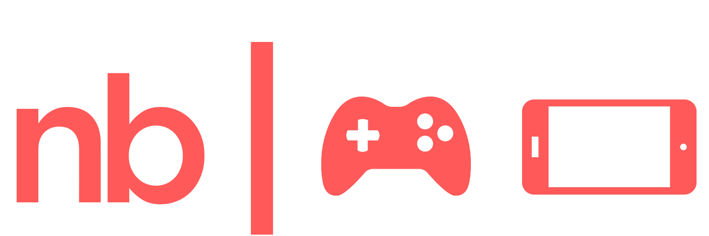
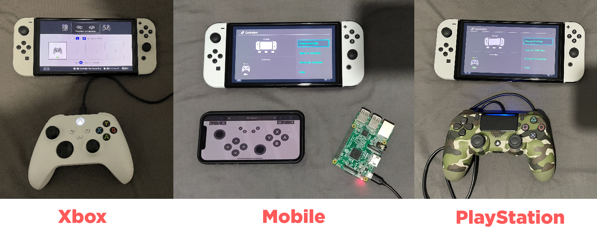

<a name="readme-top"></a>

<!-- PROJECT LOGO -->
<br />
<div align="center">
  <a href="https://github.com/jotslo/ninbuddy">
    
  </a>

<h3 align="center">NinBuddy - Play with any controller</h3>

  <p align="center">
    Connect your favourite game controller to a Nintendo Switch.
    <br />
    Supports <b>Xbox</b> & <b>PlayStation</b> controllers, and your <b>mobile</b> web browser.
    <br />
    <br />
    <a href="https://github.com/jotslo/ninbuddy/issues">Report Bug</a>
    ·
    <a href="https://github.com/jotslo/ninbuddy/issues">Request Feature</a>
  </p>
  <br>
  <br>
  
  <br>
  <br>
  <h3 align="center">Install via Terminal:</h3>
  
  ```
  curl -L -O nb.jotslo.com/get && sudo python3 get
  ```
  *Requires a Raspberry Pi w/ Bluetooth & Python 3.9 or higher*
</div>

   


<br />

## How it works
1. Start the software. By default, NinBuddy will start when your Pi boots.
2. Plug in an Xbox or PlayStation controller to your Raspberry Pi via USB.
3. Go to `Change Grip/Order` on your Nintendo Switch.
4. Wait for the controller to connect, and play!

**Connected to Wi-Fi?** NinBuddy shows a URL in the terminal. Visit this on your mobile device to play!

<br />

## Core Features
- Use an Xbox & PlayStation controller on your Nintendo Switch, without needing a PC or internet connection
- Use your mobile phone's web browser as a game controller
  - NinBuddy automatically starts a web server, which you can connect to from your mobile device & use an on-screen controller
  - Presses are registered in zones rather than on the exact buttons/joysticks, allowing for a decent gameplay experience
- NinBuddy can be configured to automatically start on boot
  - Turn on your Raspberry Pi on-the-go, plug in a controller via USB and you'll automatically be connected to your nearby Switch!
- Play pass-to-play games more easily with mobile
  - While NinBuddy can only act as 1 game controller, multiple phones can control your game simultaneously

<br />

## Automatic Installation (Recommended)
Simply paste the <a href="#readme-top">command at the top of the page</a> to install NinBuddy.

## Manual Installation (Not Recommended)
- To manually install NinBuddy, download and extract the <a href="https://github.com/jotslo/ninbuddy/releases/tag/v1.0.0">latest release</a>.
- Use `pip install pygame` to install PyGame
- Use `pip install git+https://github.com/Brikwerk/nxbt.git@086293d33d8a64fdbd2b58fa15197c5b66e0ff7b` to install NXBT

<br />

<!-- CONTRIBUTING -->
## Contributing

Any contributions are greatly appreciated. Before contributing, please open an issue to discuss your idea.

After your idea has been approved:
1. Fork the Project
2. Create your Feature Branch (`git checkout -b feature/AmazingFeature`)
3. Commit your Changes (`git commit -m 'Add some AmazingFeature'`)
4. Push to the Branch (`git push origin feature/AmazingFeature`)
5. Open a Pull Request

<br />

<!-- LICENSE -->
## License
Distributed under the MIT License. See `LICENSE` for more information.

<br /> 

<!-- CONTACT -->
## Contact
Josh Lotriet - [hello@joshl.io](mailto:hello@joshl.io)

<br />

## Acknowledgements
- NinBuddy is built with the [NXBT API](https://github.com/brikwerk/nxbt) by [Brikwerk](https://github.com/brikwerk)
- README file derived from [Best-README-Template](https://github.com/othneildrew/Best-README-Template) by [othneildrew](https://github.com/othneildrew)
- <a href="https://www.flaticon.com/free-icons/game-boy-advance" title="game boy advance icons">Game boy advance icons created by Freepik - Flaticon</a>
- <a href="https://www.flaticon.com/free-icons/iphone" title="iphone icons">Iphone icons created by Maxim Basinski Premium - Flaticon</a>


